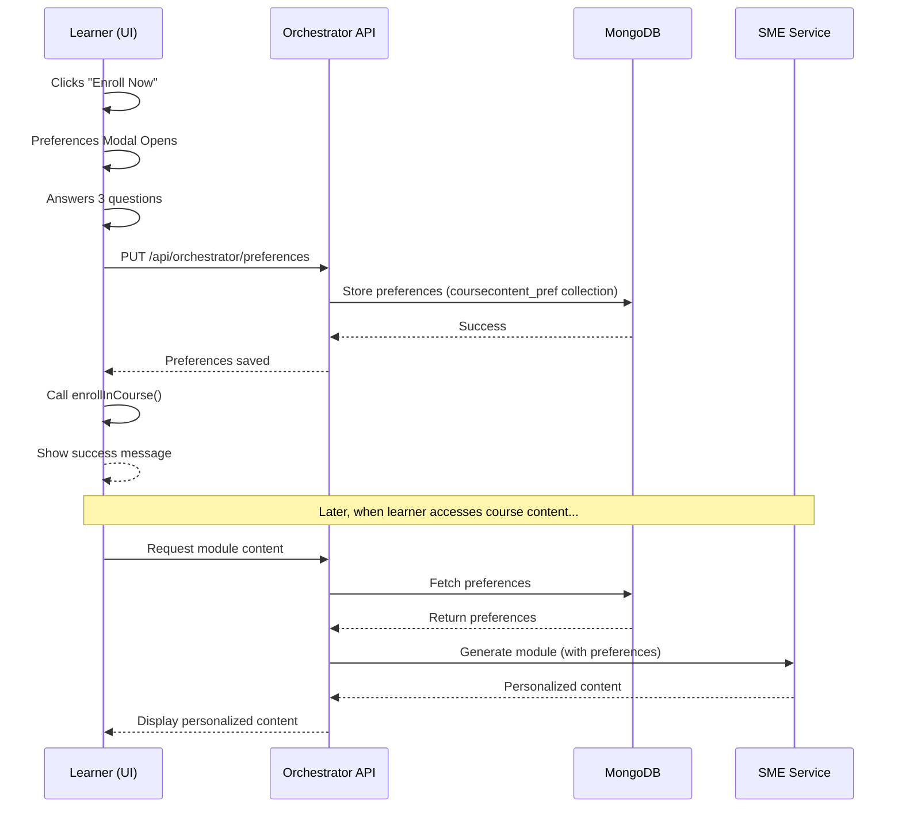

# Learning Preferences Onboarding Flow - Implementation Summary

## ✅ What Was Implemented

### 1. **Learning Preferences Modal Component**
**File**: `/ui/components/learner/learning-preferences-modal.tsx`

A beautiful, pedagogical questionnaire that asks learners 3 questions:

#### Question 1: Content Detail Level
- **Comprehensive & In-Depth** → `detailed`
- **Balanced & Clear** → `moderate` (default)
- **Concise & Focused** → `brief`

#### Question 2: Learning Style / Explanation Approach
- **Learn by Examples** → `examples-heavy`
- **Theory & Concepts First** → `conceptual` (default)
- **Hands-On & Practical** → `practical`
- **Visual Learning** → `visual`

#### Question 3: Language Complexity
- **Simple & Accessible** → `simple`
- **Balanced Approach** → `balanced` (default)
- **Technical & Precise** → `technical`

### 2. **API Integration Functions**
**File**: `/ui/lib/learner-api.ts`

Added new functions:
- `updateLearningPreferences(learnerId, courseId, preferences)` - Saves to MongoDB via Orchestrator
- `getLearningPreferences(learnerId, courseId)` - Retrieves preferences from MongoDB
- Added `LearningPreferences` and `PreferencesResponse` interfaces

### 3. **Updated Explore Page**
**File**: `/ui/app/learner/explore/page.tsx`

**New Flow**:
1. Learner clicks "Enroll Now" button
2. **Preferences modal appears** (instead of direct enrollment)
3. Learner answers 3 questions
4. Click "Save & Enroll in Course"
5. System:
   - Saves preferences to MongoDB (via `/api/orchestrator/preferences`)
   - Enrolls learner in course
   - Shows success message

### 4. **Updated SME Module Generator**
**File**: `/sme/module_gen/main.py`

Aligned preference value mappings to match the API:
- Fixed `ExplanationStyle` values
- Added `visual` option
- Updated defaults to match orchestrator

## 🔄 How It Works End-to-End



## 📊 Data Flow

### Preferences Storage (MongoDB)
```json
{
  "_id": {
    "CourseID": "COURSE_123",
    "LearnerID": "uuid-learner-456"
  },
  "preferences": {
    "DetailLevel": "detailed",
    "ExplanationStyle": "examples-heavy",
    "Language": "simple"
  },
  "lastUpdated": "2025-10-15T..."
}
```

## 🎯 User Experience

### Before
❌ Direct enrollment → No personalization → Generic content for all

### After  
✅ Questionnaire → Saved preferences → **Personalized content generation** → Better learning outcomes

## 🛠️ Technical Details

### API Endpoints Used
- `PUT http://localhost:8001/api/orchestrator/preferences` - Save preferences
- `GET http://localhost:8001/api/orchestrator/preferences/{learner_id}/{course_id}` - Retrieve preferences

### Components Created
1. `LearningPreferencesModal` - Main modal component with 3 questions
2. Updated `learner-api.ts` with preference management functions
3. Updated `explore/page.tsx` to integrate the modal

### UI Components Used
- Dialog (shadcn/ui)
- RadioGroup (shadcn/ui)
- Card (shadcn/ui)
- Button (shadcn/ui)
- Label (shadcn/ui)

## 🎨 Design Features

- **Pedagogical Language**: Questions are framed in learner-friendly terms
- **Visual Hierarchy**: Icons for each question category
- **Hover Effects**: Cards highlight on hover for better UX
- **Clear Labels**: Each option has a title and description
- **Responsive**: Works on mobile and desktop
- **Loading States**: Shows "Saving..." during submission
- **Error Handling**: Displays errors if preference saving fails

## 🚀 Next Steps

1. **Test the Flow**:
   - Login as a learner
   - Navigate to Explore page
   - Click "Enroll Now"
   - Fill out preferences
   - Verify enrollment completes

2. **Future Enhancements**:
   - Allow learners to update preferences after enrollment
   - Show current preferences on course page
   - Add a "Skip for now" option (uses defaults)
   - Analytics on preference distribution

## 📝 Environment Variables Needed

Make sure `.env.local` has:
```
NEXT_PUBLIC_ORCHESTRATOR_API_URL=http://localhost:8001
NEXT_PUBLIC_LEARNER_API_URL=http://localhost:8002
```

## ✨ Benefits

1. **Personalized Learning**: Content adapted to each learner's style
2. **Better Engagement**: Learners feel the course is "made for them"
3. **Improved Outcomes**: Content matches learning preferences
4. **Data-Driven**: Collect preference data for analytics
5. **Seamless UX**: Integrated into enrollment flow

---

**Status**: ✅ **Ready to Test**

All components are created and integrated. The flow is complete!
