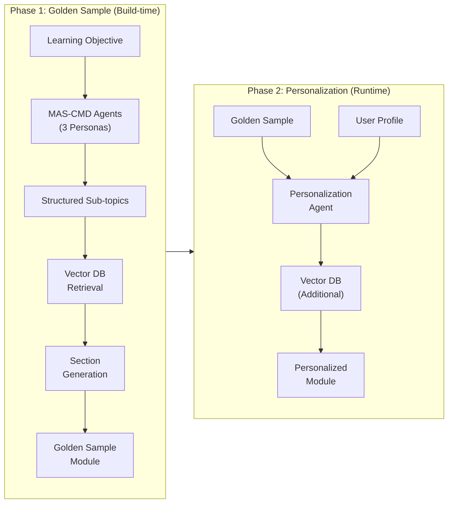
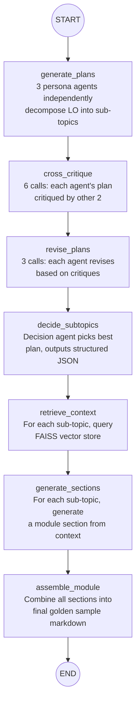
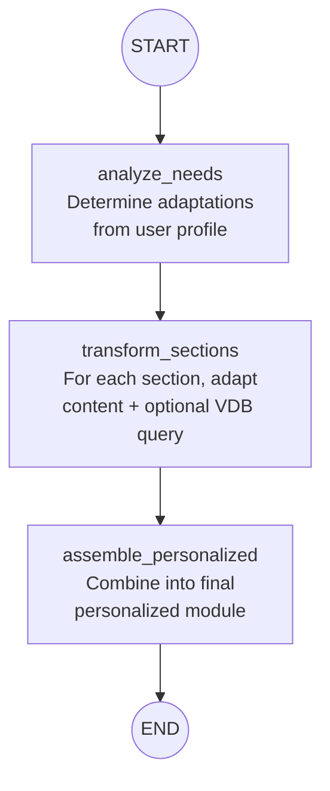

# KLI-SME Agent System

## Architecture Overview

Two LangGraph workflows connected by a shared data model:




## Directory Structure

New `sme/` directory at repo root:

- `sme/config.yaml` -- Hydra config (LLM endpoints, retrieval params, prompts)
- `sme/main.py` -- FastAPI server + CLI entry point
- `sme/schemas.py` -- Pydantic models and LangGraph state definitions
- `sme/personas.py` -- CMD pedagogical personas (adapted from KLI)
- `sme/prompts.py` -- All prompt templates for both graphs
- `sme/graphs/golden_sample.py` -- LangGraph StateGraph for golden sample generation
- `sme/graphs/personalizer.py` -- LangGraph StateGraph for runtime personalization
- `sme/retrieval.py` -- Vector store access (imports from `[sme/chat/rag.py](sme/chat/rag.py)`)
- `sme/llm.py` -- LangChain ChatOpenAI wrapper around vLLM
- `sme/requirements.txt`

## Key Design Decisions

### LLM Integration

Use `langchain_openai.ChatOpenAI` pointed at the vLLM server (OpenAI-compatible API), instead of raw httpx calls. This gives native LangChain tool/chain compatibility:

```python
from langchain_openai import ChatOpenAI

llm = ChatOpenAI(
    base_url=os.getenv("VLLM_URL"),
    api_key=os.getenv("VLLM_API_KEY"),
    model=os.getenv("VLLM_MODEL"),
    temperature=0.7,
    max_tokens=2048,
)
```

### Vector Store Access

Reuse SME's existing FAISS stores and `get_hybrid_retriever` / `get_vector_store` functions from `[sme/chat/rag.py](sme/chat/rag.py)`. The retrieval module will import these and wrap them for the LangGraph nodes.

### Personas (adapted from KLI MAS-CMD)

Reuse the 3 pedagogical perspectives from `[kli/prompts/mas_cmd_prompts.py](kli/prompts/mas_cmd_prompts.py)` (Behaviorist, Constructivist, Aesthetic) but reframe their task: instead of "design a learning activity", they "decompose a learning objective into teachable sub-topics and suggest a teaching strategy for each."

---

## Graph 1: Golden Sample Generation

LangGraph `StateGraph` with this state:

```python
class GoldenSampleState(TypedDict):
    objective: str            # the learning objective text
    module_name: str
    subject_domain: str
    grade_level: str
    course_id: str
    module_id: Optional[str]
    persona_plans: dict       # persona_key -> sub-topic plan text
    critiques: dict           # persona_key -> [critique1, critique2]
    revised_plans: dict       # persona_key -> revised plan text
    discussion_log: list      # log entries for decision agent
    final_subtopics: list     # structured list of sub-topic dicts
    retrieved_contexts: dict  # subtopic_title -> [chunks]
    sections: dict            # subtopic_title -> section markdown
    golden_sample: str        # assembled module markdown
```

### Nodes (7 total)




**Node details:**

1. `**generate_plans`** -- Calls LLM 3 times (one per persona). Each prompt includes KLI framework text + persona description + objective, asks for a structured sub-topic decomposition with: title, scope, teaching approach, depth level, and suggested search queries.
2. `**cross_critique`** -- 6 LLM calls. Each persona critiques the other two plans, focusing on: coverage completeness, pedagogical soundness, KLI alignment, logical sequencing.
3. `**revise_plans`** -- 3 LLM calls. Each persona revises their plan based on received critiques.
4. `**decide_subtopics**` -- 1 LLM call. Decision agent reviews all revised plans, selects the best decomposition, and outputs structured JSON: `[{title, description, teaching_approach, search_queries}, ...]`. Uses `JsonOutputParser` from LangChain.
5. `**retrieve_context**` -- No LLM call. For each sub-topic, queries the FAISS vector store using the sub-topic's `search_queries`. Uses `retrieve_context_for_objectives()` pattern from `[sme/module_gen/main.py](sme/module_gen/main.py)`.
6. `**generate_sections**` -- N LLM calls (one per sub-topic). Takes the retrieved context + sub-topic description + teaching approach and generates a module section in markdown.
7. `**assemble_module**` -- Pure Python. Concatenates sections with proper headers, adds metadata, and produces the final golden sample.

Total LLM calls: 13 (CMD phase) + 1 (decision) + N (sections) = 14 + N

---

## Graph 2: Personalization

LangGraph `StateGraph` with this state:

```python
class PersonalizationState(TypedDict):
    golden_sample: str
    subtopics: list           # from golden sample generation
    user_preferences: dict    # DetailLevel, ExplanationStyle, Language
    course_id: str
    module_id: Optional[str]
    user_analysis: str        # analysis of what adaptations are needed
    transformed_sections: dict
    personalized_module: str
```

### Nodes (4 total)




1. `**analyze_needs**` -- 1 LLM call. Takes user preferences + golden sample overview, determines what adaptations each section needs (more examples? simpler language? deeper detail?).
2. `**transform_sections**` -- N LLM calls. For each section: optionally retrieves additional context from vector DB based on adaptation needs, then transforms the golden sample section according to the user analysis.
3. `**assemble_personalized**` -- Pure Python. Combines transformed sections into the final personalized module.

---

## API Endpoints

Add to `[sme/apiserver.py](sme/apiserver.py)` (or standalone FastAPI in `sme/main.py`):

- `**POST /generate-golden-sample**` -- Input: courseID, moduleID, learning objective(s). Runs Graph 1. Returns golden sample + sub-topics metadata.
- `**POST /personalize-module**` -- Input: golden sample (or reference), user profile. Runs Graph 2. Returns personalized module markdown.

---

## Key Prompts to Write

All in `sme/prompts.py`:

- `build_subtopic_decomposition_prompt(persona, kli_framework, objective)` -- Phase 1
- `build_subtopic_critique_prompt(reviewer_persona, author_persona, plan)` -- Phase 2
- `build_subtopic_revision_prompt(persona, plan, critiques)` -- Phase 3
- `build_decision_prompt(all_plans, discussion_log)` -- Phase 4 (includes JSON schema)
- `build_section_generation_prompt(subtopic, context, teaching_approach)` -- Phase 6
- `build_needs_analysis_prompt(golden_overview, user_prefs)` -- Personalization
- `build_section_transform_prompt(section, adaptation_instructions, extra_context)` -- Personalization

